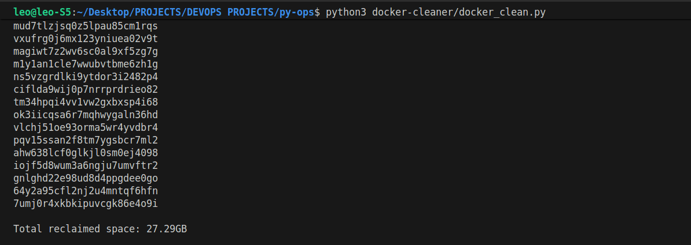
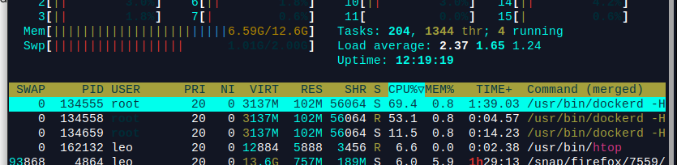

## Docker Cleaner

### Performance & Impact

The script was tested on a production VPS (Ubuntu 22.04, 12.6GB RAM). 

It successfully identified and removed orphaned layers and volumes that were no longer in use.

### Results:

- **Storage Recovered:** 27.29 GB

- **System Behavior:** During execution, the Docker daemon (`dockerd`) reached a peak CPU usage of ~70%, efficiently handled by the system's multi-threading without affecting overall stability.

